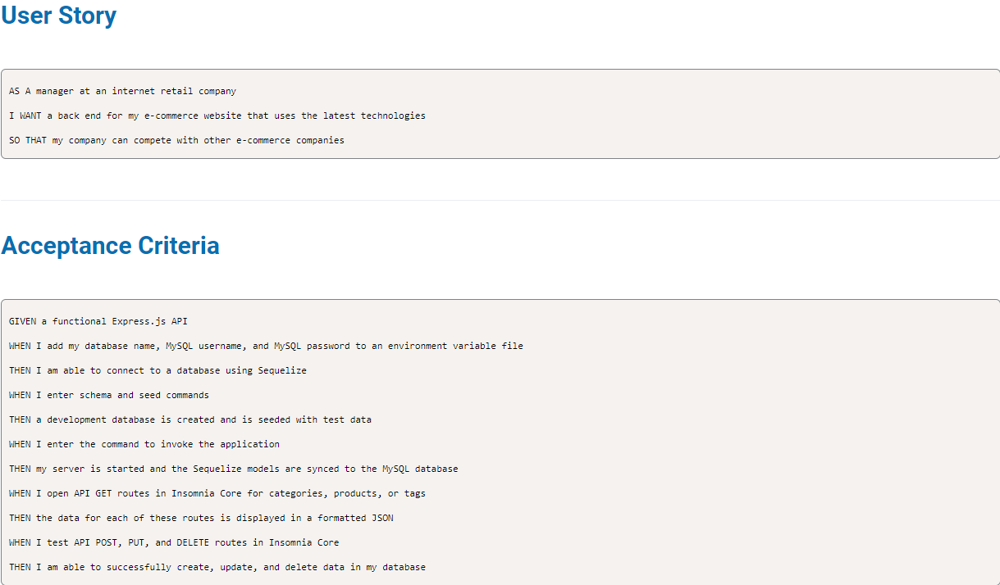

# E-Commerce-Back-End      
# Description 

This is a mysql database and application backend for an e-commerce site. Built using MySQL2, Express, Sequelize and dotenv. 


# Table of content 
* [Installation](#installation)
* [Usage](#usage) 
* [Links](#links) 
* [Questions](#questions) 

# Installation 

```
git clone https://github.com/Jelenarog/E-commerce-Back-End
```
Npm packages used for this application:
```
npm init
npm install mysql2
npm install sequelize
npm install dotenv
```
# Usage 
Run the following command at the root of your project: <br>
Log in into mySql:
```
mysql -u root -p
```
Enter your mySql password
Source database:
```
source db/schema.sql
```
Exit mySql:
```
quit
```
Seed data base:
```
node seeds/index
```
Run the application
```
node server
```
# License 

This application is covered under MIT, to find more information about it click on https://choosealicense.com/licenses/mit/. 
# Links 

Github repo: https://github.com/Jelenarog/Employee-Tracker <br>
Starter code: https://github.com/coding-boot-camp/fantastic-umbrella <br>
Demo: 

# Questions 

If you have any additional questions you can reach me at jelena.rogic90@gmail.com. 

Link to my Github profile: https://github.com/JelenaRog
